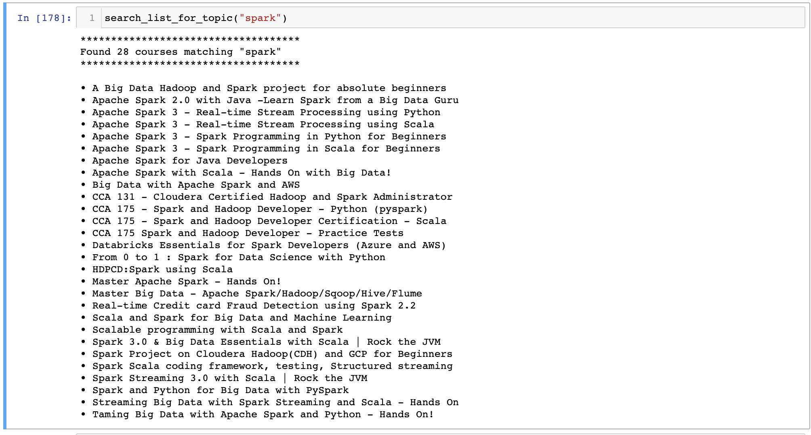

# Udemy business course list

This repo consists of the Udemy for Business course list PDF along with a Jupyter notebook to parse and search through the PDF text. Search terms can be passed like so:

